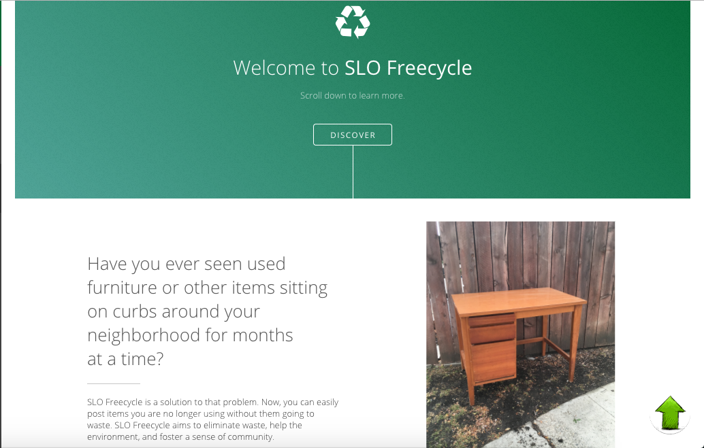
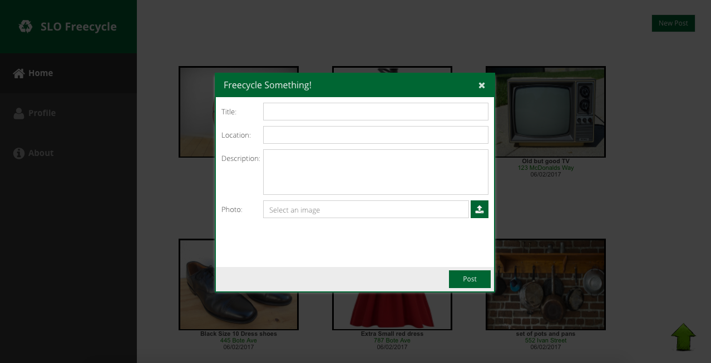

# Slo Freecycle Web Application

## 1. Motivation

As students head out of their apartments and houses for summer, they often discard tons of reusable items. What’s left behind are traces of the unfortunate habit of over consumption resulting in an increase of waste in landfills. Often, owners do not intend for their items to be wasted, it is just too difficult for them to find a place to donate their items or find others who would want them. With this problem in mind, the idea of SLO Freecycle was born.

## 2. Sign Up

**********

## 3. Login

**********

## 4. About

**********

********

**********

********

## 5. New Post Feature

**********

## 6. Home Page

